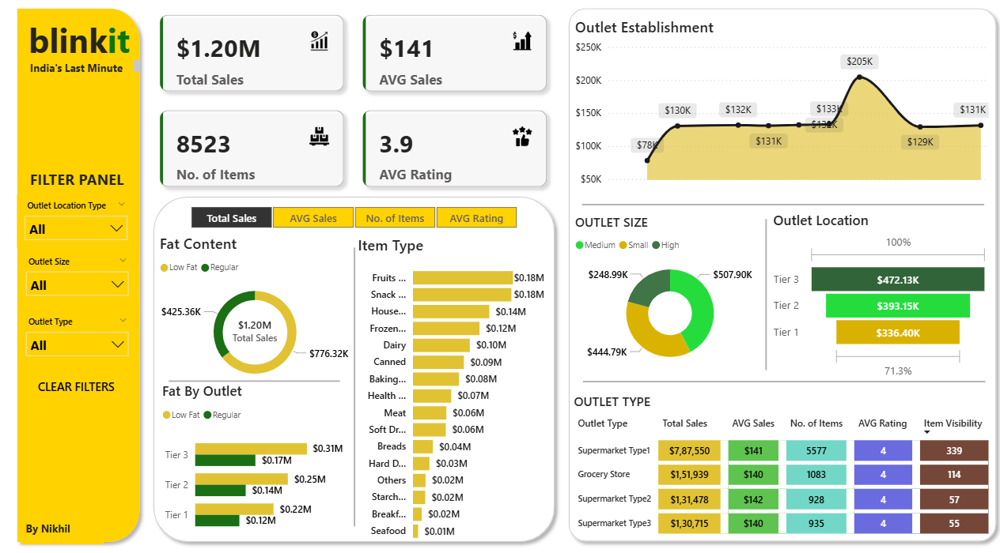

# 🚀Blinkit Power BI Dashboard: Sales, Trends & KPIs

This project presents an interactive Power BI dashboard designed to provide a comprehensive analysis of Blinkit's sales performance and trends. The dashboard incorporates key performance indicators (KPIs), dynamic charts, and visualizations to offer actionable insights into business performance.

A dedicated filter panel allows users to seamlessly explore data across different outlet locations, sizes, and types, enabling tailored analysis for strategic decision-making. The goal of this dashboard is to empower stakeholders with a clear, data-driven view of sales trends, regional performance variations, and key business metrics — all in a single, user-friendly interface.

**Download my BlinkIT PowerBI Dashboard from here** - https://github.com/Gnikhil677/Power-BI---BlinkIT/blob/main/blinkit.pbix

## 🎯 Project Objectives:

1. **Provide Key Sales KPIs**
   Display essential metrics such as **Total Sales**, **Average Sales**, **Number of Items Sold**, and **Average Product Ratings** to monitor overall business performance.

2. **Analyze Performance by Product Characteristics**
   Break down KPIs by **Item Type**, **Fat Content**, and **Fat Content by Outlet** to uncover patterns in customer preferences and product performance.

3. **Evaluate Outlet Performance Over Time**
   Visualize **Outlet Revenues** from their **establishment year** to identify high-performing outlets and detect those that may need strategic improvements.

4. **Segment Outlet Revenue by Business Attributes**
   Provide detailed revenue analysis based on **Outlet Size**, **Location Tier (Tier 1, Tier 2, Tier 3 cities)**, and **Outlet Type**, allowing for targeted decision-making and localized strategies.

### 📄 Dataset Source

The dataset used for this Power BI dashboard project was sourced from the Data Tutorials YouTube channel. The project was developed with guidance provided in the channel’s tutorial, which served as a foundation for building the interactive sales and trends analysis dashboard.

### ✨ PowerBI Skills Utilized :

1. **Dashboard Designing**
   Crafted an intuitive and visually engaging layout to enhance user experience and ensure clarity in data presentation.

2. **Data Visualization (Charts & Graphs)**
   Utilized various charts and visual elements (bar charts, line graphs, KPI cards, slicers, etc.) to represent sales trends and performance metrics effectively.

3. **Power Query**
   Applied Power Query for data transformation, cleaning, and shaping to prepare the dataset for analysis.

4. **Power Pivot**
   Managed data modeling and relationships using Power Pivot to create a robust data model for efficient reporting.

5. **DAX (Data Analysis Expressions)**
   Developed custom measures and calculated columns using DAX to compute key metrics such as total sales, average sales, number of items sold, and average ratings.

## 💡**Key Performance Indicators (KPIs)**

**KPIs (Key Performance Indicators)** are measurable values that help evaluate the success of an organization, project, or activity in achieving specific objectives. In business intelligence and dashboards, KPIs provide a quick, high-level overview of performance and help decision-makers monitor progress and identify areas for improvement.

**KPIs Included in My Blinkit Dashboard**

1. 💰  **Total Sales**
   Shows the overall revenue generated across all outlets, giving a snapshot of total business performance.

   

2. 💵 **Average Sales**
   Calculates the average sales value, helping to understand sales consistency and identify fluctuations over time.
   
   

3. 🔢  **Number of Items Sold**
   Represents the total quantity of items sold, offering insight into product demand and volume.

   

4. 🌟 **Average Rating**
   Displays the average customer rating of products, reflecting customer satisfaction and product quality.

   

## Great! Here's an updated and complete explanation that includes the **filter panel** as well, maintaining the same clear and professional tone:

---

## 🧀 Fat Content & Item Types

This section of the Blinkit Power BI dashboard provides an in-depth view of **Total Sales**, allowing users to analyze performance across different dimensions such as product fat content, outlet tier, and item type. It helps identify top-performing products and outlets, as well as areas needing improvement.

#### **Interactive Filter Panel**

At the top of the dashboard, an **interactive filter panel** allows users to switch between key metrics:

* **Total Sales**
* **Average Sales**
* **Number of Items**
* **Average Rating**

This feature enhances the dashboard’s flexibility, enabling users to explore the same visual structure using different KPIs for a more comprehensive analysis.

#### **1. Total Sales by Fat Content**

A **donut chart** displays the breakdown of total sales by fat content:

* **Low Fat**: \$425.36K
* **Regular**: \$776.32K
* **Total Sales**: \$1.20M

This helps assess consumer preferences between low-fat and regular products.

#### **2. Fat Content by Outlet Tier**

A **stacked bar chart** shows how sales for low fat and regular products vary across city tiers:

* **Tier 3**: \$0.31M
* **Tier 2**: \$0.25M
* **Tier 1**: \$0.22M

This comparison highlights how dietary preferences and product performance differ by market segment.

#### **3. Total Sales by Item Type**

A **horizontal bar chart** ranks item categories based on total sales:

* Top contributors include **Fruits and Vegetables**, **Snack Foods**, and **Household Items**, each generating over \$0.14M.
* Lower performing categories include **Seafood**, **Breakfast**, and **Starchy Foods**.

This breakdown helps businesses focus on high-performing categories and reconsider strategy for the lower ones.

## 🏪**Outlet Analysis**

This section of the Blinkit Power BI dashboard offers a detailed analysis of **outlet performance** across different attributes—such as establishment year, size, location, and type. The insights help identify which outlets are thriving and which may need attention or strategic changes.

#### **1. Outlet Establishment Performance Over Time**

A **line and area chart** illustrates sales trends based on the year of outlet establishment.

* Revenue peaked at **\$205K** in one year, indicating a standout performance.
* Earlier establishments started lower (e.g., **\$78K**), and newer ones show varied performance.
  This trend helps track the **impact of outlet maturity** on revenue generation.

#### **2. Outlet Size Distribution**

A **donut chart** breaks down sales by **outlet size**:

* **High-size outlets** lead with **\$507.90K**
* **Medium** and **Small** outlets contribute **\$444.79K** and **\$248.99K**, respectively
  This breakdown helps assess whether larger outlets consistently perform better.

#### **3. Outlet Location (City Tier-wise)**

A **bar chart** displays total sales by **city tier**:

* **Tier 3 cities** top the list with **\$472.13K**
* **Tier 2** and **Tier 1** follow with **\$393.15K** and **\$336.40K** respectively
  These insights are crucial for **geographic performance analysis**, highlighting stronger regional markets.

#### **4. Outlet Type Comparison Table**

A **detailed matrix** compares key KPIs across different **outlet types**:

* **Supermarket Type 1** dominates with **\$7.87M** in total sales and the highest item visibility (339 items)
* All outlet types maintain consistent **average ratings of 4**
* Other types such as **Grocery Stores**, **Supermarket Type 2**, and **Supermarket Type 3** show similar average sales (\~\$140–\$141), but differ in item counts and visibility

## ⚙️**Filter Panel**

The **Filter Panel** allows users to **interactively customize the entire dashboard** based on specific business needs. It enhances user experience by enabling focused analysis through dynamic filtering.

#### **Filter Options:**

1. **Outlet Location Type**
   Filter data based on the geographic classification of outlets (e.g., Tier 1, Tier 2, Tier 3 cities).

2. **Outlet Size**
   Narrow down insights based on outlet size categories: *Small*, *Medium*, or *High*.

3. **Outlet Type**
   Select from different store types like *Supermarket Type 1*, *Supermarket Type 2*, *Grocery Store*, etc., to analyze performance specific to each format.

#### **Clear Filters Option**

The **"Clear Filters"** button resets all selections, bringing the dashboard back to its full view for an unrestricted overview.

This filter panel adds flexibility and ensures users can easily tailor the visualizations to answer specific questions or explore targeted insights.

## 💯FINAL DASHBOARD (screenshot)

**To Download the Dashboard** - https://github.com/Gnikhil677/Power-BI---BlinkIT/blob/main/blinkit.pbix

## ✍️CONCLUSION - 

This Blinkit Power BI dashboard project was developed to perform an in-depth **sales analysis**, incorporating a wide range of **KPIs and interactive visuals**. It enables business managers to gain **valuable insights** through data-driven storytelling—highlighting key metrics like total and average sales, number of items sold, and average customer ratings.

By offering detailed breakdowns based on **item types, fat content, outlet location, size, and type**, the dashboard empowers decision-makers to **identify high-performing segments** and focus on **improving underperforming areas**. The inclusion of a dynamic **filter panel** further enhances the dashboard’s usability, allowing for focused and customizable analysis.

From a learning perspective, this project significantly contributed to my understanding of **advanced data analysis using Power BI**. It also helped me improve my **dashboard design skills**, with a focus on clarity, interactivity, and effective visual communication.

Overall, this project reflects the practical application of Power BI in generating actionable business insights and reinforces the value of well-crafted dashboards in data-driven decision-making.
